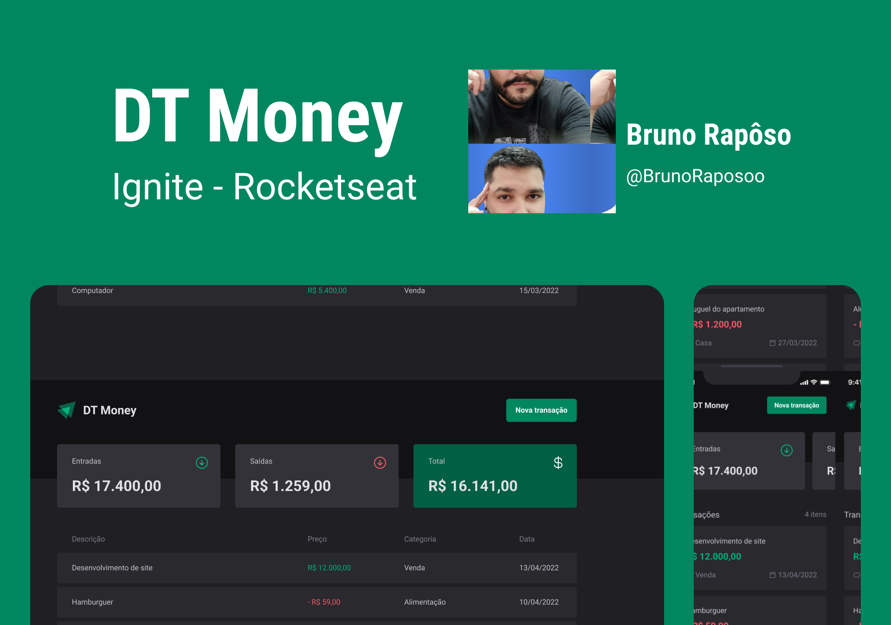

<h1 align="center">
    
</h1>

  <a href="#rocket-tecnologias">Tecnologias</a>&nbsp;&nbsp;&nbsp;|&nbsp;&nbsp;&nbsp;
  <a href="#-projeto">Projeto</a>&nbsp;&nbsp;&nbsp;|&nbsp;&nbsp;&nbsp;
  <a href="#-layout">Layout</a>&nbsp;&nbsp;&nbsp;|&nbsp;&nbsp;&nbsp;
  <a href="#memo-licença">Licença</a>

 

  

 

  

## 🚀 Tecnologias

Esse projeto foi desenvolvido com as seguintes tecnologias:

- [ReactJS](https://pt-br.reactjs.org/)
- [TypeScript](https://www.typescriptlang.org/)
- [Vite](https://vitejs.dev/)
- [Styled Components](https://styled-components.com/)
- [React Router](https://reactrouter.com/en/main)
- [Radix Ui](https://www.radix-ui.com/)
- [Reac Hook form](https://react-hook-form.com/)
- [axios](https://axios-http.com/ptbr/docs/intro)
- [json-server](https://github.com/typicode/json-server)
- [Zod](https://github.com/colinhacks/zod)

## 💻 Projeto

Projeto feito no curso de React da Rocketseat Ignite. Consiste em desenvolver uma sistema de controle fincanceiro. Acrescentar entradas e saídas e o total de recurso do usuário, cadastrar novas ações e realizar buscas. 

para acessar o projeto [clique aqui]()

## 🔖 Layout

Você pode visualizar o layout do projeto através [desse link](https://www.figma.com/file/pWfHNPplrcsdsjvE1E1V2j/DT-Money-(Community)?type=design&node-id=0-1&t=PH7H7siEWYEZHlxx-0). Lembrando que você precisa ter uma conta no [Figma](http://figma.com/) para acessá-lo.

## Licença

Esse projeto está sob a licença MIT. Veja o arquivo [LICENSE](LICENSE.md) para mais detalhes.

---